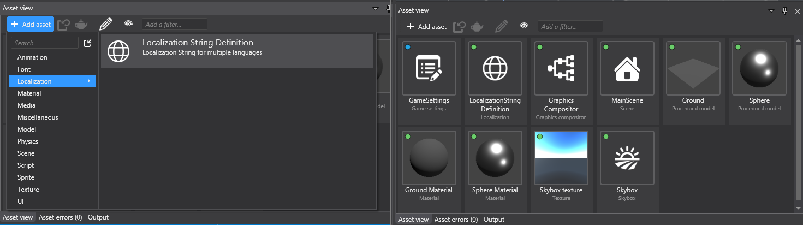

# Custom Asset Example [CAE]

The purpose of this example is to show how to create a custom asset that can be referenced by your custom scripts/components, using a "Localization String" asset as an example.

Note that this may not be officially supported, so use at your own risk.

The projects are linked in the following way:
```
CustomAssetExample.Windows ---> CustomAssetExample ----o----------------------------------------------o---------------------------------------------> CustomAssetExample.SharedData
                                                        \                                              \                                        /
                                                         \                                              \                                      /
                                                          ---> CustomAssetExample.GameStudioExt -------> CustomAssetExample.StrideAssetExt ----
                                                          
```
---
There are two types of "Custom Assets" which are required:
- Design-time/Compiler app asset which derives from `Asset`. This is serialized as a YAML file which is read/written by the Stride Editor.
- Run-time asset. The design-time asset is processed through Stride's CompilerApp.exe and serialized as a binary file which is what gets loaded when you run your game. Note that the design-time asset is never seen by the run-time game.

---
The most complicated part is setting up all the files required for the **design-time** custom asset.
In this project the design-time custom asset is `LocalizationStringDefinitionAsset` defined in the project `CustomAssetExample.StrideAssetExt`. Its run-time equivalent is  `LocalizationStringDefinitionAsset` in the project `CustomAssetExample.StrideAssetExt`, which is also explicitly declared in the `[AssetContentType]` attribute.

To properly support the design-time asset, the following things are required:
- All Stride assets are *compiled* through Stride.Core.Assets.CompilerApp.exe, so `LocalizationStringDefinitionAssetCompiler` is required so the compiler app knows how to convert the design-time asset into the runtime equivalent.
- `EditorModule` contains the `[ModuleInitializer]` which is required so Stride's CompilerApp and Editor are aware the `CustomAssetExample.StrideAssetExt` library contains custom assets.
- The design-time asset requires a 'template definition' which is defined in `Templates\Assets\LocalizationStringDefinition.sdtpl`. Some of the properties (eg. Name, Icon, etc) are things that appear in the Stride editor when creating a new asset.
- In order for Stride to detect any template definitions, this needs to be defined in `CustomAssetExample.StrideAssetExt.sdpkg`.
- `LocalizationStringDefinitionAssetFactory` can be used to set up default values when creating a new asset through the editor.

---
The `CustomAssetExample.SharedData` contains the run-time data of the custom asset, which is used by the directly by your `SyncScript`/`AsyncScript`/components.
In this project `LocalizationStringRefScript` has a property to `UrlReference<LocalizationStringDefinition>` and loads the compiled asset (as `LocalizationStringDefinition`) at the start of the script.

`CustomAssetExample.StrideAssetExt` also references this project since it compiles the custom asset (`LocalizationStringDefinitionAsset`) to the run-time equivalent (`LocalizationStringDefinition`) through `LocalizationStringDefinitionAssetCompiler`.

> For the sake of this example project, the design-time asset and run-time asset have matching fields, however you can change them to have completely different definitions and/or do additional processing (eg. read some external file) when you process it through your derived AssetCompiler class.

---
`CustomAssetExample.GameStudioExt` provides additional supporting files for the editor only (which is optional).
If you want a custom icon for your custom asset to appear in the Asset view sub-window, you require a embeded resource file (`.resx` file) and embed your image/icon in there.
`LocalizationStringDefinitionThumbnailCompiler` derives `StaticThumbnailCompiler` and passes the embedded image through the constructor.
> `CustomAssetExample.GameStudioExt` also requires `EditorModule` for Stride to detect it contains asset related code.

Note that the constructor only accepts `byte[]`, but when you add your image to the `.resx` file Visual Studio always adds the file as a Bitmap.
After you add the image, you will need to manually open the file (as xml text) and change the type from `Bitmap` to `Byte[]`, eg.
```
<value>GameSettingsThumbnail;System.Drawing.Bitmap, System.Drawing, Version=4.0.0.0, Culture=neutral, PublicKeyToken=b03f5f7f11d50a3a</value>
```
Change the file type (and the referenced library) to:
```
<value>GameSettingsThumbnail.png;System.Byte[], mscorlib, Version=4.0.0.0, Culture=neutral, PublicKeyToken=b03f5f7f11d50a3a</value>
```

> Note: There are **two** separate icon images.
> - The image in `CustomAssetExample.StrideAssetExt\Templates\.sdtpl\Localization.png` is a 48x48px image that appears in the "Add asset" dropdown option.
> - The image in `CustomAssetExample.GameStudioExt\Resources\LocalizationThumbnail.png` is a 128x128px image that appears the Asset view sub-window.
> - To make the icons match closely with Stride's icons, 48x48px as-is can be used for the 48x48px image, whereas a centered 72x72px icon should be used for the 128x128px image.




---
### Limitations

1. `CustomAssetExample` is required to reference `CustomAssetExample.GameStudioExt` & `CustomAssetExample.StrideAssetExt` due to how the asset compiler works. Unfortunately these references things like `Stride.Core.Assets.Editor` which crash when running at run-time due to weird dll/exe conflicts. To workaround this issue we must create a separate build **Configuration**, eg. this project has created `DebugExGameEditor` which allows building without the Stride Editor library.
>  Maybe in the future the asset compiler will be able to reference them separately, so the compiler specific dlls also do not get included in the output folder when building the game, but for now this is necessary.

2. `Stride.Core.Assets.Editor` is a Windows only library and is referenced by `CustomAssetExample.GameStudioExt`. Due to the limitation #1, this means the entire game project must have `TargetFramework` set to `net8.0-windows`.


**Game Studio Note:** Be wary of soft reloading (or using the `Reload game assembiles and update scripts` button). Sometimes Game Studio may not load correctly reload the `GameStudioExt` project, causing the custom assets to not load correctly (and any `Script`s/`Component`s referencing the custom assets may lose its reference to the asset).
Changes to the asset class also do not get updated with a soft reload.
Using a hard reload is recommended. (ie. `File -> Reload project`).

### Troubleshooting

If you find your custom asset not detected by Game Studio, ensure there is a template file (`.sdtpl`), and that it is referenced in the `.sdpkg` file of the `CustomAssetExample.StrideAssetExt` project.
