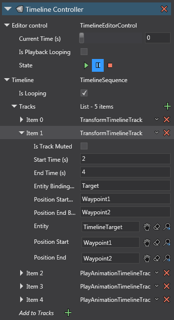

# Cutscene Timeline Example [CTE]

This project includes code and assets for playing (and previewing) an in-game cutscene.
As of version 4.1.0.1734, there is no proper cutscene/timeline editor. This is a (clunky) workaround to provide such feature.

`TimelineController` is the component to be added to an entity. It holds an editor control that can be used to preview the timeline within Game Studio, and the `TimelineSequence` which holds the tracks that will be played.

This example shows `TransformTimelineTrack` and `PlayAnimationTimelineTrack` which derive from `TimelineTrackBase`, which shows a character playing Idle animation and & moving with a Walking animation. Additional track type implementations should also derive from `TimelineTrackBase`, and it'll be picked up automatically in Game Studio.

This example contains two variations of the `TimelineController`.

1. `TimelineController` directly placed in the scene.
2. `TimelineController` in a prefab (and loaded into the scene) - it can be played directly as is, or played with retargeted waypoints (ie. position where the character moves from/to).

When using the prefab, you will be expected to find the entity's `TimelineController` in order to play it.

In the settings image below, there are three properties that can be used to retarget entities in a timeline: '`Entity Binding Name`', '`Position Start Binding Name`', and '`Position End Binding Name`'.

This can be useful if you want to be able to replay a given cutscene but need to change the character, or change where the character is moving.

---
**Important Note:** The previewing feature in Game Studio scene editor can be buggy, due to hacky code used to trick the editor to allow playing character animations (this is because Game Studio does not run animations in the scene editor). Be aware that entity modifications via the timeline (eg. `TransformTimelineTrack`) do not properly reflect back to the editor's property window, and saving the scene may save their position/rotation/scale as at the time of when you stopped the timeline playback.

`AnimationAssetEditorGameCompilerExt` is the class that reinstates the character animation within the scene editor. Be aware that if you make code changes and the code is reloaded in Game Studio, then the scene may stop playing animations due to quirks of the original system. If you close and re-open the scene, the animation should be replayable again.

The compilation symbol `GAME_EDITOR` is used over the entire `AnimationAssetEditorGameCompilerExt.cs` file and for conditionally referencing `Stride.Editor`. This is because they are not necessary for release builds.

---

Also note there is a quirk where playing the animation in Game Studio will replay at a low frame rate. This is because Game Studio deems the scene window as out of focus and renders at a low frame rate. Left clicking anywhere within the scene will trigger it as in focus and will render at full frame rate.
