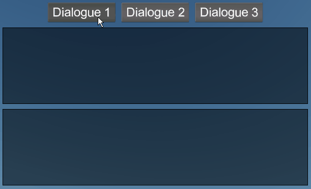

# Dialogue Text Control Example [DTC]

This project includes code and assets for proof of concept for an RPG-styled dialogue text box (a custom Stride UI control).

Note that custom controls require registering a `GameUIRendererFactory` and creating a `.sduilib` file, this is done similarly as explained in [UI Navigation Example.](../UINavigationExample)

---
`DialogueText` is the actual UI control that should be added to a `UIPage` asset (which in turn should be added to a `UIController` on an entity in a scene).

You can then assign `DialogueText.Text` with your coded text, which uses a style similar to XML/HTML.
This text is parsed by `DialogueTextParser` which builds displayable text as `DialogueTextGlyph` and detects the 'tags' and builds creates text effect associated with the tag name.

Text effects are classes that inherit `DialogueTextEffectBase` which must also be registered in `DialogueTextEffectRegistry` with the desired tag name.

eg. `BoldTextEffect` has registered with a tag name "`b`", so bolded text can be written as `<b>example_text</b>`.

`DialogueText` then builds `DialogueTextGlyphRenderInfo`s for all the `DialogueTextGlyph`s, which is used by `DialogueTextRenderer` to process and render the text.
Before rendering, text effects are passed `DialogueTextGlyphRenderInfo` which it can manipulate to get the desired behavior.

`DialogueStartupController` contains three example coded text which shows some example text and their displayed behavior:

Note that the parser is not strict (this is so that it shouldn't be crashing when parsing at runtime).

* If it doesn't recognize a tag, it will just treat it as normal text.
* If a tag isn't closed properly, the text effect for that tag will execute up to the end of the text.
* Partial overlap of tags are allowed since they are (somewhat) independent, eg. `<b>this is <i>partial overlapping</b> tags</i>`.

Audio has not been implemented in this example, but there a multiple ways to solve this:

* Add a field to `DialogueText` to reference an audio asset, then either play the audio as a text effect, or use `DialogueText.TextCharacterAppeared` event.
* Create a text effect and dynamically play audio (may be harder to implemented).

---
**Advanced programmer note:**

`DialogueTextRenderer` requires access to some internal objects that Stride does not expose publicly, which is done via reflection. This means this may break in the future (though unlikely for the time being).

Refer to `StrideInternalExtensions` to see which fields/methods accessed.

---
**Limitations of this proof of concept:**

* Could possibly be more optimized by caching certain calculations.
* Does not support arbitrary fonts - this would probably be a new text effect, but research would be required into dynamically loading new fonts.
* Bold & Italic font style is complicated. You need to reference *four* fonts to get the right style, 'Normal', 'Bold', 'Italic', and 'Bold & Italic'. This is effectively the same issue as the previous point.
* Text may not appear correctly in Stride Game Studio. This is because `GameUIRendererFactory` is not registered within the editor.
* Zero detection of conflicting tags, eg. overlapping duplicate tags (this is a 'feature').
* Object fields/properties are not properly protected from the user (mainly the case with text effects being passed `DialogueTextGlyphRenderInfo`). If a custom text effect manipulates a field it shouldn't be writing into, it may not render the character correctly.
