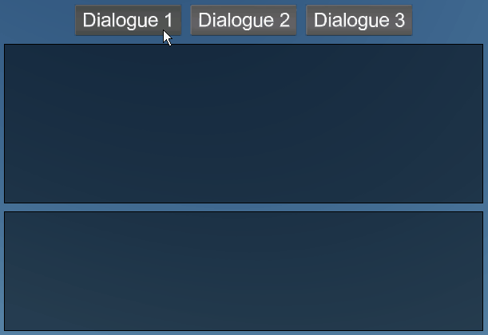

# Dialogue Text Control Example [DTC]

This project includes code and assets for proof of concept for an RPG-styled dialogue text box (a custom Stride UI control).

Note that custom controls require registering a `GameUIRendererFactory` and creating a `.sduilib` file, this is done similarly as explained in [UI Navigation Example](../UINavigationExample), however this differs in that we register the `GameUIRendererFactory` with our new `UIRenderFeatureExt` render feature (which replaces the existing `UIRenderFeature` in the Graphics Compositor).

---
`DialogueStartupController` contains three example coded text which shows some example text and their displayed behavior, eg:

Note that the parser is not strict (this is so that it shouldn't be crashing when parsing at runtime).

* If it doesn't recognize a tag, it will just treat it as normal text.
* If a tag isn't closed properly, the text effect for that tag will execute up to the end of the text.
* Partial overlap of tags are allowed since they are (somewhat) independent, eg. `<b>this is <i>partial overlapping</b> tags</i>`.

---
## Usage

The custom control is `DialogueText` and you assign `DialogueText.Text` with your coded text, which uses a style similar to XML/HTML.

This text is parsed by `DialogueTextParser` which builds displayable text as `DialogueTextGlyph` and detects the 'tags' and builds creates text effect associated with the tag name.

Text effects are classes that inherit `DialogueTextEffectBase` which must also be registered in `DialogueTextEffectRegistry` with the desired tag name.

eg. `BoldTextEffect` has registered with a tag name "`b`", so bolded text can be written as `<b>example_text</b>`.

`DialogueText` then builds `DialogueTextGlyphRenderInfo`s for all the `DialogueTextGlyph`s, which is used by `DialogueTextRenderer` to process and render the text.
Before rendering, text effects are passed `DialogueTextGlyphRenderInfo` (and/or `TextEffectData` for shader related data) which it can manipulate to get the desired behavior.

---
## Implementation Details

The following steps are used to register this custom control to work in Stride:

* `DialogueText` is the actual UI control and behaves the same as any existing Stride controls (ie. add to a `UIPage` asset, which in turn should be added to a `UIController` on an entity in a scene).
* `DialogueTextParser` which builds displayable text as `DialogueTextGlyph` and when special tags are detected it checks `DialogueTextEffectRegistry` for any registered text effect tags and creates the instances of them (which classess that inherit `DialogueTextEffectBase`).
* A custom renderer `DialogueTextRenderer`, which extends `ElementRenderer`, is implemented to handle the main logic of rendering the `DialogueText`'s characters/glyphs.
* The standard UI control renderer uses a `UIBatch` which contains the shader/effects used to render the font (which is locked). To work around this, a custom `UIFontBatch` is implemented, which is mostly a re-implementation of `UIBatch` (and cut out unused features), but also extended to support our text effects (eg. pass a custom `TextFontVertex` to the shader for information about our glyphs). Also see the HeatWaveTextEffect for a text effect that works via the shader.
* `DialogueTextRenderer` then uses the `UIFontBatch` instead to render the fonts. Note that there are two effects for the fonts, one for signed distance field (SDF) fonts and another for non-SDF fonts. To ensure we don't need to implement our custom shader logic twice, both effects go through a common shader, `TextFontShaderShared.sdsl`, which is where we actually write any custom shader text effect logic.
* Implement a `GameUIRendererFactory` which inherits `IElementRendererFactory` which maps our `DialogueText` control to the `DialogueTextRenderer`.
* Our `GameUIRendererFactory` must then be registered to the `UIRenderFeature`, which is how Stride determines what renderer to use for each control. The timing of registering the `GameUIRendererFactory` would be tricky with the existing `UIRenderFeature`, so it was easier to just replace the existing `UIRenderFeature` with our implementation `UIRenderFeatureExt` (which extends `UIRenderFeature`) and register the `GameUIRendererFactory` in the `InitializeCore` method. Replacing the `UIRenderFeature` is done via the Graphics Compositor, as seen in the screenshot (all settings are the same as the original `UIRenderFeature`):

---
Audio has not been implemented in this example, but there a multiple ways to solve this:

* Add a field to `DialogueText` to reference an audio asset, then either play the audio as a text effect, or use `DialogueText.TextCharacterAppeared` event.
* Create a text effect and dynamically play audio (may be harder to implemented).

---
**Advanced programmer note:**

`DialogueTextRenderer` requires access to some internal objects that Stride does not expose publicly, which is done via reflection. This means this may break in the future (though unlikely for the time being).

Refer to `StrideInternalExtensions` to see which fields/methods accessed.

HeatWave text effect works by shifting the sampling of UV coordinates. If you shift too far (ie. large Amplitude), you will start sampling adjacent characters. The alternative solution is to render onto a render texture, do any processing work and then render that texture into the scene.

---
**Potential future work:**

Add a color gradient text effect via shader. A potential way to implement this is the following:

* Search all the SpriteFont's characters to find the max & min height of a character.
* Based on the gradient mode (ControlBlock | PerLine | PerWord), determine the dimensions of the effect in the font space (this is like a second set of UV coordinates).
* Calculate the character's vertices position relative to the effect font space, and add to `TextFontVertex`. Note this calculation will use the character's base line offset & the max/min height of the character to determine this.
* In the shader use these UV coordinates to determine where the pixel shader is in the gradient.

---
**Limitations of this proof of concept:**

* Could possibly be more optimized by caching certain calculations.
* Does not support arbitrary fonts - this would probably be a new text effect, but research would be required into dynamically loading new fonts.
* Bold & Italic font style is complicated. You need to reference *four* fonts to get the right style, 'Normal', 'Bold', 'Italic', and 'Bold & Italic'. This is effectively the same issue as the previous point.
* Text may not appear correctly in Stride Game Studio. This is because `GameUIRendererFactory` is not registered within the editor.
* Zero detection of conflicting tags, eg. overlapping duplicate tags (this is a 'feature').
* Object fields/properties are not properly protected from the user (mainly the case with text effects being passed `DialogueTextGlyphRenderInfo`). If a custom text effect manipulates a field it shouldn't be writing into, it may not render the character correctly.
