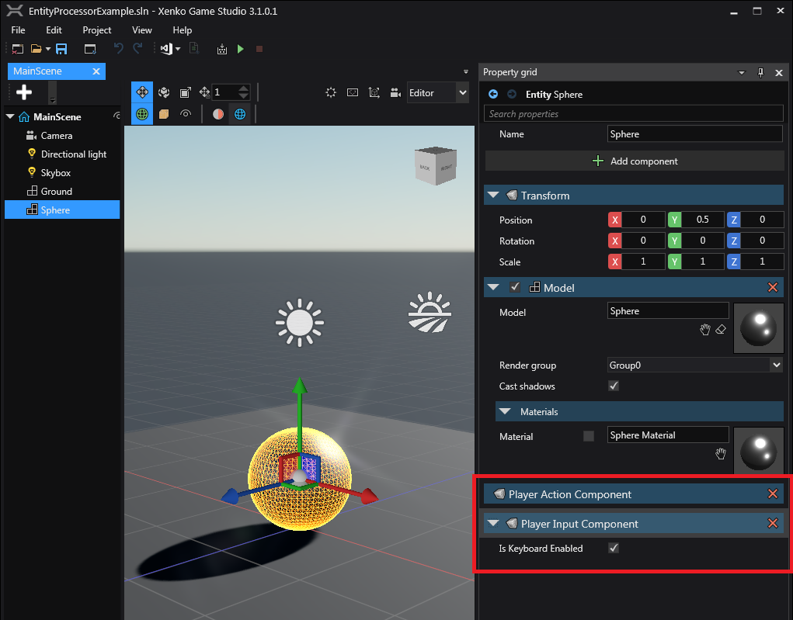

# Entity Component/Processor Example [EPS]

The purpose of this example is to show a 'processor-centric' approach to the Entity system, rather than the more common 'component-centric' approach (which heavily relies on the 'Script' components).

This advantage of this approach is that you can be aware of all entities of the same type, and process them as suited to your needs.
As of version 3.1.0.1, Xenko does not support a running a true 'headless' game, and all ScriptComponents heavily rely on the existence of Graphics/Audio systems etc.
Having your own processor/component bypasses this issue, however you will need to implement your own version of SyncScript/AsyncScript if you need your 'headless' game to use similar functionality.

All the relevant code is contained within the `EntityProcessorExample\Player` folder, and the only 'external' setup required are the components that must be attached to the desired entity (as seen in MainScene.xkscene).

This example involves two EntityComponents and two EntityProcessors, the PlayerInputComponent/Processor and  PlayerActionComponent/Processor.

The `PlayerInputProcessor` is responsible for registering the appropriate input device(s) to the entity (via the `PlayerInputComponent`) and assigning/mapping the input to the `PlayerActionComponent`.
The `PlayerActionProcessor` is responsible for reading the `PlayerActionComponent` and applying the changes to the entity.

In this example the components are attached to the 'Sphere' entity (and also the `BasicCameraController` component is removed from the Camera entity which came with the 'New game' template that was originally processing the input).
The Sphere moves with WASD keys.

**Game Studio Note:** When you create a custom component, ensure it is a `public` class, and you must do a *hard* reload for the Game Studio to detect the component (ie. `File -> Reload project`).
