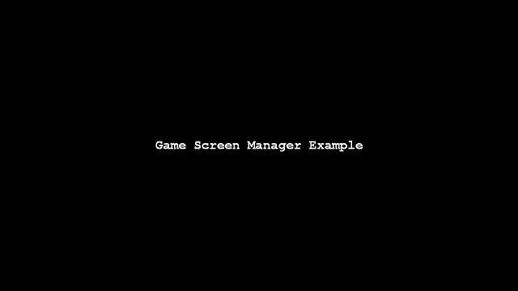
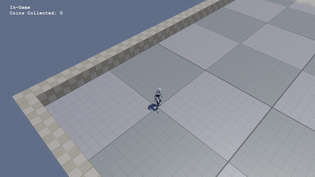
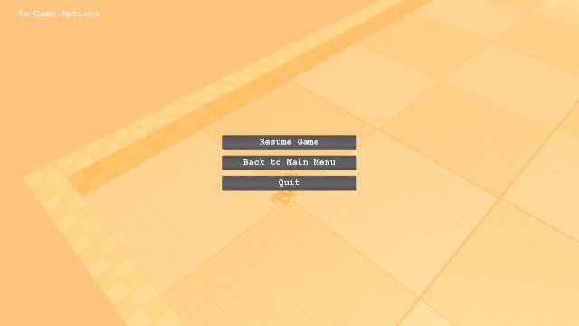
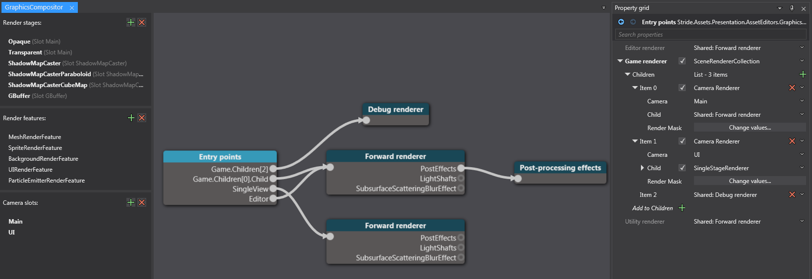
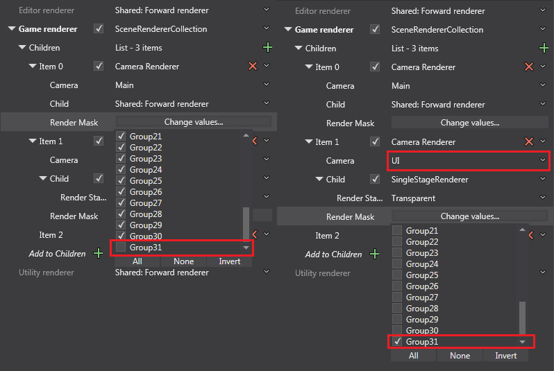

# Game Screen Manager Example [GSM]

This project includes code and assets for game screen management.

There are two important interfaces that are used for screen management, `ISceneHandler` and `IPageHandler`.
Excluding the `RootScene`, there are three main scenes `SplashScreen`, `TitleScreen`, and `InGame`, which can be treated as distinct 'screens'. All three scenes contain a `SceneController` entity which is used as a bridge between Stride code and our `ISceneHandler` code. Each scene handler implementation handles back-end related code to each scene, eg. `SplashScreenSceneHandler` loads splash screens's UI and also loads the next scene (the title screen) and calls the `SceneManager` to change scenes. 

The UI parts of the scene implemented with prefabs containing a single 'PageController' entity, which holds a `PageController` and a `UIComponent`, and this 'UI entity' is passed to the `UIManager` to track which UI 'screen' is being displayed/active.

*Side note:* For convenience, we derive from `SceneHandlerBase` and `PageHandlerBase` to reduce boiler-plate code for `ISceneHandler` and `IPageHandler`, respectively.

**Warning:** Ensure each scene only contain ONE scene handler, and each UI prefab only contain ONE page handler.

For convenience, the entity prefab `SceneControllerBase` located in `Assets/Scenes/` can be used to be added to any new scenes, the entity prefab `UIPageControllerBase` located in `Assets/UI/` can be used when creating new UI/PageControllers.

**Warning:** Do not change or override the entity names in these prefabs, as the underlying screen management code relies on these names to retrieve specific classes.

There is one important scene that should not be modified, the `RootScene`.
This houses the globally persistent entities `GameManager`, `RootMainCamera`, `UIManager` and `RootUICamera`, which should not be removed at any time while running.
Also note that the `UIManager` and `RootUICamera` entities are actually not part of the `RootScene`, but rather is part of the `UISystem` prefab and added afterwards. The reason for this separation is for the potential of being able to run scenes without any UI (eg. headless server), however additional coding will be required to get this to fully functional.

From a coding perspective, adding/removing scenes must be done through `SceneManager` rather than modifying the scene collection anywhere else. It is especially important to not reassign `SceneSystem.SceneInstance.RootScene` since this will effectively remove the main managers. Changing UI must be done via `UIManager` in order to properly track which UI is being displayed.

### Screen Navigation

Basic diagram of the screen navigation in the project:
```
                            --------------------------------------------
                            v                                          |
[Splash Screen] --> [Title Screen] --> [In-Game Screen] <--> (In-Game Options Screen) --> [[Quit]]
                      ^                   ^
                      |                   |
                      |                   |
                      --> (Load Game Screen)
                      |
                      --> (Options Screen)
                      |
                      --> [[Quit]]


[...] = Scene + PageHandler
(...) = PageHandler

```

Some example screenshots of some of the screens:

Splash Screen



Title Screen


In-Game Screen



In-Game Options Sub-Screen



**Additional Setup:**

By default, Stride renders everything in the same pipeline, which includes post-processing effects.

Generally, you do not want the rendered UI to be using the same post-processing effects (if any) as this treats the UI as if it's part of the game world, so to avoid this issue the `GraphicsCompositor` has been changed so that `RenderGroup31` is rendered separately and the UI is only rendered in this group with a SingleStageRenderer (which also will not render with any post-processing effects).
The UI is provided its own Camera Slot (named UI), and this Camera is added to the root scene.



Main camera rendering all except `Group31` (Left), UI camera only rendering UI entities in `Group31` (Right)



**Other Notes:**

The following is beyond the scope of this example:
* Game pause when in options sub-screen.
* Properly ignoring input in when a sub-screen is not at the top of the stack (or perhaps allowing some input is still ok).
* Properly stop game sounds/music when changing screens.
* Transferring game data between screens (this can probably be done through the `GameManager` entity when changing scenes).
* Properly change the main camera when changing screens.
