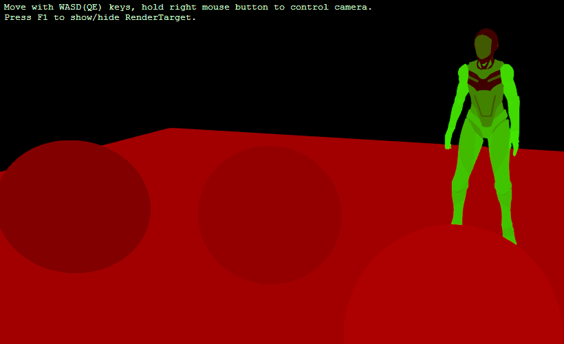

# Object Info Render Target Example [OIRT]

This project renders object (entity) information (ModelComponent ID, Mesh & Material Indices) onto a render target, which is then read by a Material shader to display.

This code is adapted from Xenko's `PickingSceneRenderer` class, except made to output the entire view and to make it accessible to custom shaders on materials.

Example of output of RenderTarget identifying the different ModelComponents of each entity in red, the different mesh indices (of a single model) in green (color is normalized to appear on screen):

**Project Notes:**

Ensure the .sdsl and .sdfx files have the Custom Tool property set to XenkoShaderKeyGenerator in Visual Studio, so it can automatically build the .cs files. This requires the Xenko plugin for Visual Studio installed.

**Usage Notes:**

To use in your own project, you will also need to set up the `GraphicsCompositor`. Refer to the images below for examples.

- Add an `ObjectInfo` render stage (both effect slot name and name should be the same).
- In the `MeshRenderFeature`, add the (sub) render feature `ObjectInfoRenderFeature`, and the render stage selector `ObjectInfoRenderStageSelector`.
- For `ObjectInfoRenderStageSelector`, set the Effect Name as `ObjectInfoOutputEffect` (this is the name of the effect in `Effects\ObjectInfoOutputEffect.sdfx`), set the Object Info Render Stage to the above `ObjectInfo`, Render Group can be set to whatever objects you want to be written to the texture.
- If running with the default setup, select the `Entry points` node, add `ObjectInfoSceneRenderer` as a child in the property (Game renderer -> Camera Renderer -> Child -> SceneRendererCollection -> Children).

  **Important Note:** Make this appear *before* the `Shared: Forward renderer` renderer (easiest way is to add to the end, save, then modifier the `Assets\GraphicsCompositor.xkgfxcomp` file directly to shift it.)

**Scene Notes:**

The example scene has the "Wall" entity in Render group `Group10`, and the `ObjectInforRenderStageSelector` to exclude this group, to ensure it is not captured in the render target texture, and only used for output rendering purposes only.

---
### Code Explanation

`ObjectInfoSceneRenderer` does the actual encoding (rendering) of the object info. Since it is expected to be used by the standard rendering system (eg. used in a custom shader on a material), you must make sure this renderer is ordered *before* the Forward renderer.
At the end of the draw call, it will set up the generated texture for consumption (consumption example is the shader `ObjectInfoOutputTestShader.sdsl`).

The `ObjectInfoRenderFeature` generates the "buffer" data, ie. the entity data we want the `ObjectInfoOutputEffect` to read and output, and `ObjectInfoRenderStageSelector` declares the effect/shader that reads this buffer data (`ObjectInfoOutputEffect.sdfx` & `ObjectInfoOutputShader.sdsl`, where the Effect Name is declared in the Graphics Compositor).

Note that in order for skinned (animated) models to be rendered correctly on the texture, we need to inherit the shaders that compute the skinned transformations. Unfortunately, we cannot add the mixin `XenkoForwardShadingEffect`, due to heavy ties with `ShaderBase`. The problem with `ShaderBase` is that it declares the pixel output (`SV_Target0`) as `float4`, which works fine for a `float4` format texture, but our object info texture is `uint2` format, so we want a pixel output of `uint2`.

To solve this, we essentially copy `XenkoForwardShadingEffect.sdfx` and most of the mixin shaders that it uses, and change every shader that inherits `ShaderBase` to inherit our `OioShaderBase` instead, which declares `SV_Target0` as `uint2`. All these shaders are placed in `Effects\ObjectInfoXenkoBaseShaders` folder.

---
### Graphics Compositor Setup

ObjectInfo render stage:

ObjectInfoSceneRenderer:

ObjectInfoRenderFeature and ObjectInfoRenderStageSelector:

