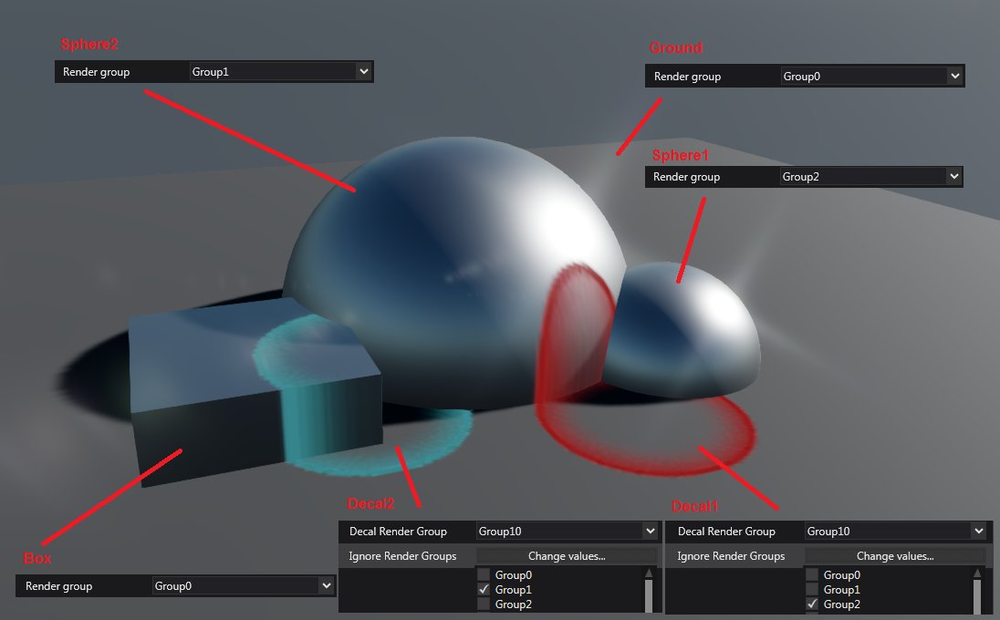

# XenkoProofOfConcepts

This repository houses a few basic projects to test capabilities of the Xenko Game Engine.

The projects are currently built with Xenko version **3.1.0.1**, and have only been created with the Windows projects (apologies to any non-Windows developers!).

---
*New Note:* `GameScreenManagerExample` is built in Stride version **4.0.0.1-beta03-1036**, but all projects are intended to be upgraded to the official release version of Stride when it is released, with the exception of the `BepuPhysicsExample` project as it is incomplete and abandoned.

---

These projects are aimed more towards intermediate to advanced programmers, and may require further investigation into the Xenko source code, or search online, for more information on how some of the applied code works, as some of the some techniques may not be officially what the Xenko developers intended for us to use.

Currently there are six projects:
* `EntityProcessorExample`: Processor-centric code rather than "Script"/Component-centric code.
* `ObjectInfoRenderTargetExample`: Render entity information onto a `Texture` and then read this in a subsequent shader.
* `ScreenSpaceDecalExample`: Use a cube projector and renders a given `Texture` onto any surfaces within the projector.
* `ScreenSpaceDecalRootRendererExample`: Similar to `ScreenSpaceDecalExample`, but uses a `RootRenderFeature` instead of making a processor fake a `RenderMesh`.
* `GameScreenManagerExample`: Game screen navigation via a GameScreenManager entity.
* `BepuPhysicsExample`: A rough attempt at integrating Bepu2 physics engine into Xenko (this is not completed and has been abandoned).

---
The only project worth showing a screenshot of for this front-end readme file is the `ScreenSpaceDecalExample`:

Note that the `ScreenSpaceDecalExample` project can be seen as an accumulation of applying the techniques from both the `EntityProcessorExample` and `ObjectInfoRenderTargetExample` projects, so it may be worthwhile understanding those projects before trying to look at the `ScreenSpaceDecalExample` project.
