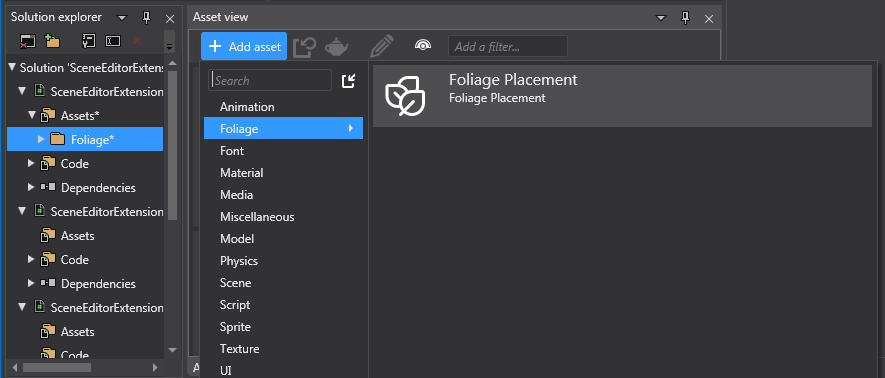
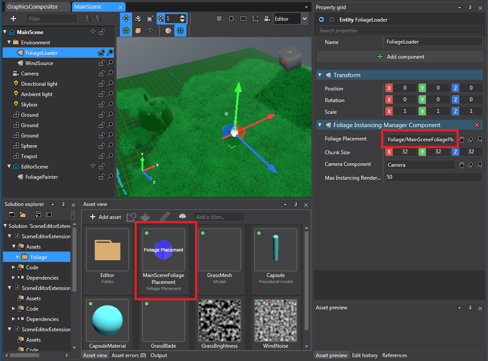
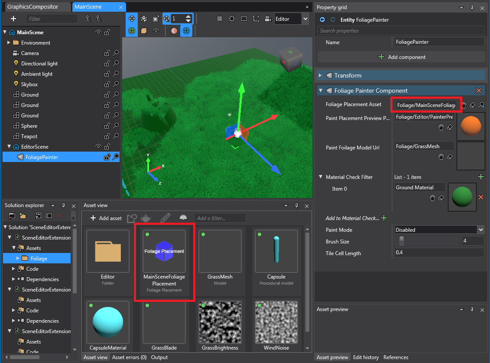
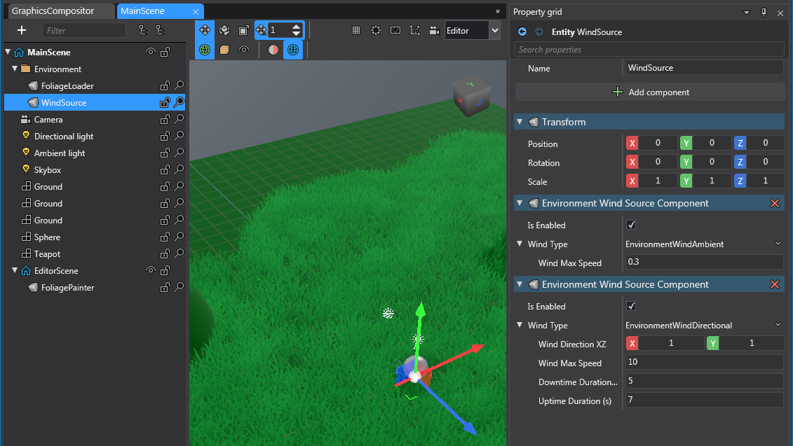
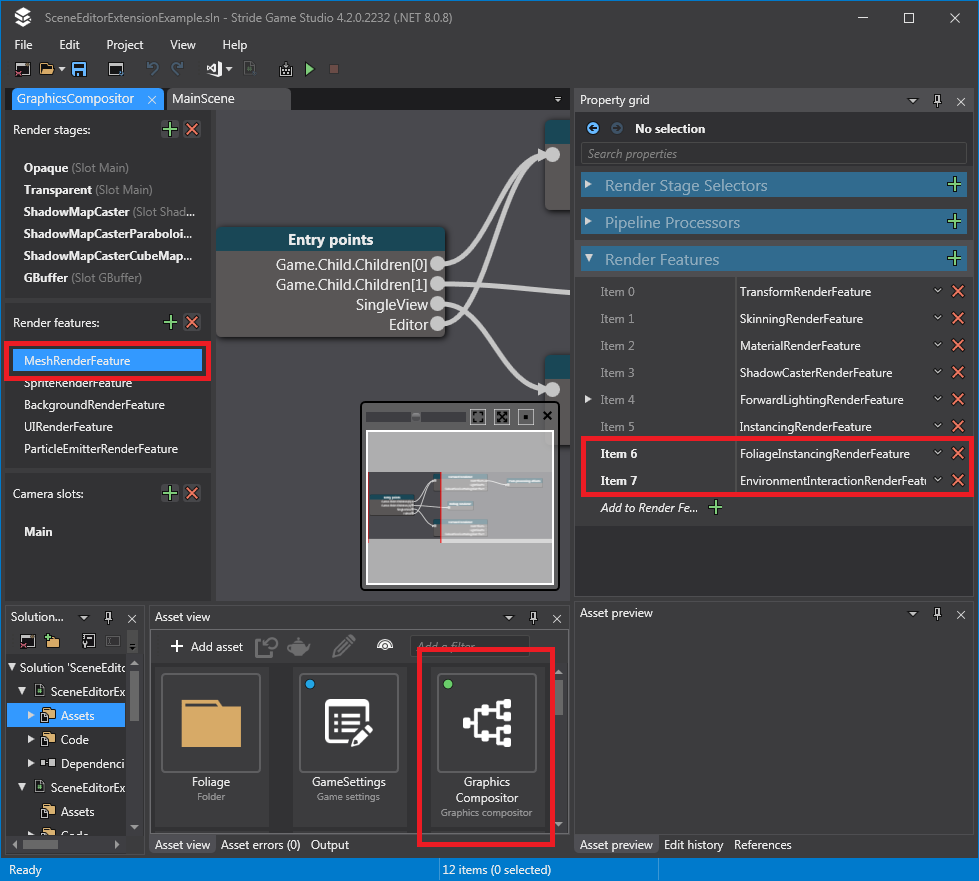
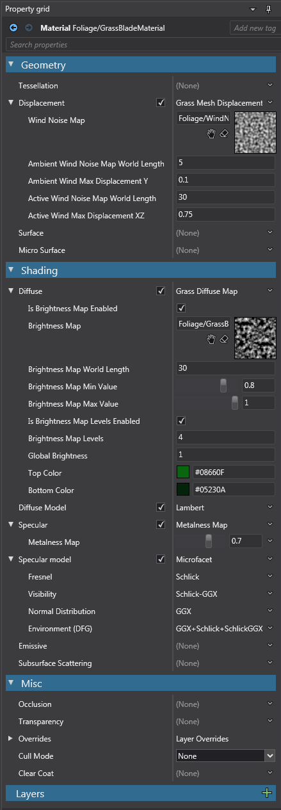

# Scene Editor Extension Example [SEE]

This project includes code and assets for a proof of concept for extending editing capabilities in Stride Game Studio to populate foliage in a game scene.

> ## ------ **Important Note** ------
> ## This should be treated as highly unstable code. If you are not an advanced programmer or an investigative type of person, and/or have low tolerance to application crashes, do not attempt to incorporate this in your own projects.
> ## You have been warned!

---

## Prerequisites
This project contains various techniques applied from other proof of concept projects. The projects and how they apply to this project are the following:
- [CustomAssetExample](../CustomAssetExample): Custom asset used to store the foliage data.
- [LevelEditorExtensionExample](LevelEditorExtensionExample): Running run-time editor code and coordinating it to modify editor 'design-time' assets. The restrictions/limitations stated in that project applies to this project.
- [Stride Material Shader Guide](https://github.com/Basewq/BasewqStrideMaterialShaderGuide): Use `MaterialFeature`s and `SubRenderFeature`s to make a grass shader that is affected by wind and movable objects.

> It is advised to be familiar with the above links to get a better grasp of this project before proceeding further.

- This requires advance knowledge in how Stride Game Studio works, on a programming level, as Game Studio does not currently officially support extending the editor.
- Visual Studio is required in order to run the standalone exe (debug/release builds), due to different compilation symbols required when running in Game Studio or the standalone exe.
- As of version `4.2.0.2232`, you can only build/run the standalone exe in `DebugExGameEditor` or `Release` builds, because there are nuget/dll library reference issues when referencing Stride Editor & Asset related libraries.

---

## Overview

Foliage data are stored in a standalone asset called **Foliage Placement**, which contains position, rotation, scale, and the models to render.

At run-time, a script should load the **Foliage Placement** asset and create instancing meshes to render the foliage.

Creating and modifying foliage data in the **Foliage Placement** asset is done in the Game Studio, where an editor processor is added as a **sub-scene** of the scene you're working on. By adding it specifically as a sub-scene, this avoids having unwanted entities at run-time because sub-scenes do not get automatically loaded when a scene is loaded.

---

## Foliage Painter Editor & Scene Setup

For a scene to have foliage, you must create a new **Foliage Placement** asset.

For the foliage to appear at run-time, create an entity with a `FoliageInstancingManagerComponent` in the main scene.
Make sure the **Foliage Placement** asset is referenced in this component.

The other settings are used to make rendering more efficient:
- Chunk Size: Divides the instancing meshes into eg. 32x32 game units chunks. This is used to allow frustum culling to occur for the instancing meshes.
- Camera Component: The camera to check against to determine which foliage chunks should be created/removed.
- Max Instancing Render Distance: Instead of the camera's frustum 'far plane' value (which can have an extremely large value), we use this value so the chunks are culled at a shorter distance. This project has this value at 50 game units to purposely show chunks being culled/regenerated.

To create/edit foliage, a sub-scene is created and added to the scene you are working on, along with an entity with a `FoliagePainterComponent`.

The settings have the following functionality:
- Foliage Placement Asset: The **Foliage Placement** asset which is read/written to.
- Paint Placement Preview Prefab Url: This should be prefab of the brush, which should just be a simple semi-transparent model sphere which will be used as the appearance of the painter's 'brush'. Note that the actual 'brush' is hardcoded as a sphere.
- Paint Foilage Model Url: The model to be used when painting the foliage. The foliage asset supports multiple models, however the painter only will only allow painting a single model at a time (just change the model when you want to paint a different model).
- Material Check Filter: A list of materials to determine whether a foliage can be placed on the model in the current scene.
- Paint Mode: The paint mode, ie. Disabled, Paint, Erase.
- Brush Size: The size of the brush when painting/erasing.
- Tile Cell Length: The distance between each foliage when painting.

For the grass to be affected by wind, `EnvironmentWindSourceComponent`s can be added to an entity.

The wind data is passed to any material shader that inherits `EnvironmentWindSources` shader, and it is up to the inherited shader to determine how it should be affected based on this data.
Only ambient and directional wind sources have been implemented in this project.

For the mesh instancing to work correctly, the Graphics Compositor must be updated to include our custom `SubRenderFeature`s:
- `FoliageInstancingRenderFeature` is how we pass our custom instancing data to the instancing mesh.
- `EnvironmentInteractionRenderFeature` is an optional render feature, used for allowing grass to be pushed around by any entity with an `EnvironmentInteractorComponent`.

---

## Grass Setup

This project uses a semi-stylized looking grass, which requires a specific material setup and shaders.
Because the grass mesh relies on instancing, the grass material is fed custom instancing data via `FoliageInstancingRenderFeature`.
`EnvironmentInteractionRenderFeature` is also used so the grass can be affected by wind and other entities.

The Graphics Compositor needs to include these Sub-render Features:

The grass material uses custom `MaterialFeature`s (`MaterialGrassMeshDisplacementFeature` and `MaterialGrassDiffuseMapFeature`, for grass movement and grass color, respectively).

The grass mesh was created in Blender following the Youtube video [Creating the Mesh - How To Make Stylized Grass for Godot 4 Tutorial](https://www.youtube.com/watch?v=Yk_uRFZrL9k) from [StayAtHomeDev](https://www.youtube.com/@stayathomedev), but using less quads and ignoring the steps regarding changing the vertex normals - this is because the vertex normals are manually set within our material shader, due to the video explanation below.

For an explanation on why the vertex normals needs to be manually changed is explained in the Youtube video [Fixing Bad Grass Shadows in UE4](https://www.youtube.com/watch?v=U94pwpZQsRY) from [PrismaticaDev](https://www.youtube.com/@PrismaticaDev).

---

## Implementation Details
- The project setup is similar to the [LevelEditorExtensionExample](LevelEditorExtensionExample) project. The short explanation is that some Stride libraries are required to be referenced so we can interact with the Editor, however these references must be removed in standalone executable, therefore if you want to run the exe, you must build and run in the configuration `DebugExGameEditor` or `Release`, and use `Debug` exclusively for Game Studio (and enable compilation symbol `GAME_EDITOR` only in `Debug`).
- `FoliagePainterProcessor` is the main logic for our custom editor. `FoliagePainterComponent` is where we expose the painting properties.
- Due to editor quirks, there are a few additional classes required to trick the editor into accepting our editor code:
    - `FoliagePainterEditorMouseService`: Used to prevent the internal editors from listening the mouse input. `FoliagePainterProcessor.OnSystemAdd` shows reflection used to force our `FoliagePainterEditorMouseService` into the other mouse services.
    - `FoliageMeshManager`: `ModelPlacement` (which is used in `FoliagePlacementAsset`) only stores `UrlReference<Model>` for its model. The `FoliageInstancingManagerComponent` loads the `Model` via `ContentManager`, however in the Editor, assets are not loadable in `ContentManager` unless it is registered in the `IEditorContentLoader`. `FoliageMeshManager` is used to ensure any model we reference will be allowed to be loadable.
    - The code to interact with Game Studio is mostly done within in `SceneEditorExtProcessor`, which is consumed as the interface `IStrideEditorService`. Unfortunately there are a lot of quirks and threading issues (run-time vs UI thread), which is the main source of unstability in our custom editor.
- `FoliageInstancingManagerComponent` & `FoliageInstancingManagerProcessor`: The main logic for showing the foliage, which are divided into chunks. It's job is to simply determine which chunks are visible in the camera, and then create/remove sub-entities with mesh instancing.
- `EnvironmentInteractorComponent` & `EnvironmentInteractorProcessor`: Simple entity data which gets passed to `EnvironmentInteractionRenderFeature` so the grass material is aware of any 'interactable' entities.
- `EnvironmentWindSourceProcessor` & `EnvironmentWindSourceComponent`: Simple entity data which gets passed to `EnvironmentInteractionRenderFeature` so the grass material is aware of any wind.

---

### Limitations/Known Issues
- If the editor scene throws an `Exception` while in the middle of painting, the mouse becomes locked in the center. If you right click (which opens a context menu), then press `Alt+Tab`, it'll break out of the mouse lock.
- Reloading assemblies in Game Studio due to code changes should be avoided and may crash the Editor. It is advised to just hard restart the Editor.
- The foliage painter only populates the meshes via instancing. This means there are no physics colliders involved, so is not usable for populating 'real' objects (eg. blocking trees).
- The design-time asset (`FoliagePlacementAsset`) stores the YAML contents in an easy to read but extremely inefficient form. This means saving the data with a lot of foliages can bloat the asset file (eg. 10+ MB if painting on a large scene). A possible workaround would be to use a custom `[ContentSerializer]` and read/write binary.
- Manually unloading/reloading the sub-scene with the editor entity may crash the Game Studio (unstable code!).
- Erasing foliages in the editor may cause temporary flickering. This is probably due to some issue with how the custom instancing material data is updated. This should not affect the run-time version since it does not constantly update the custom instancing data.
- The brush type is hardcoded. Perhaps the logic should be moved into the Painter Preview Prefab.
- Many additional 'paint' settings could be moved out and exposed to the editor (eg. max surface angle tolerance, position/rotation/scale randomization settings).
- No level of detail (LOD) implemented for the meshes. This should probably be implemented in the `FoliageInstancingManagerComponent` in the same logic where the visibility check on the chunks occur.
