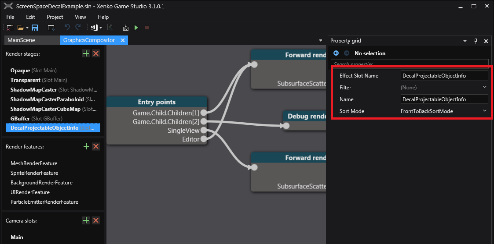
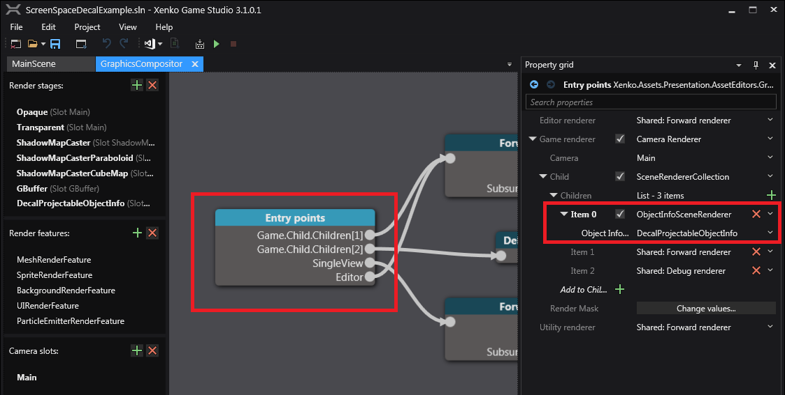
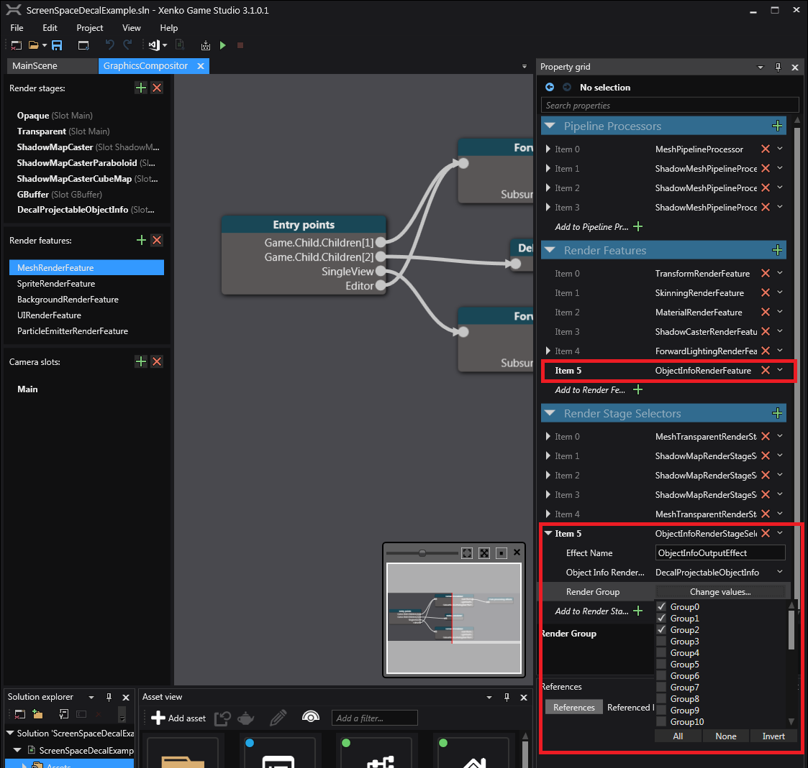

# Screen Space Decal Example [SSD]

This projects adds a screen space projected decal system which uses a custom entity processor to read the `DecalComponent` to feed a `RenderMesh` with our custom shader material to be consumed by the standard rendering system.
This is a hacky solution as it relies on copying the existing rendering system's data format.

The decal entity uses a 1x1x1 cube as a projector to render the selected texture onto whatever is inside the projector's 'box'.

Current limitations (however someone smart may be able to implement/extend):
* This is only useful for *static* entities (eg. ground), and will not work well with skinned (animatable) models.
* Only a texture is rendered, no normal map.
* There isn't a way to preview the cube, which would be useful for debugging purposes.

---
### Example Scene

This example shows the decal rendering on every RenderGroup except for the ones specified on the Ignore Render Groups mask.

In a real case scenario, you would set the Ignore Render Groups to whatever Render Group(s) the dynamic (animatable) models are set with (and make sure these are not the same Render Groups that you use for static models).

---
Currently, a new material object is generated per `DecalComponent` (ie. per *entity*).
This probably needs to be changed to allow reuse of material instances, however be aware if any of the `DecalComponent`'s field changes at run-time this will affect *all* entities using the same material instance, so would need to check every render frame if it still belongs to the same material and change to a new material if it's not.

**Important Game Studio Notes:** 
* The entity with the `DecalComponent` is not selectable in the Game Studio scene editor, and must be selected by the entity tree sub-window.
* `DecalComponent.IgnoreRenderGroups` does not appear to work in the Game Studio scene editor (due to some oddity with how we're passing the ObjectInfo render target texture), however will work correctly at run-time.

---
In the future, it may be possible to make the entity selectable in the scene editor.
This will require creating a `GizmoComponent`, which is part of the `Xenko.Assets.Presentation` library, however referencing this library stops the game project from compiling.

---
### Graphics Compositor Setup

ObjectInfo render stage:

ObjectInfoSceneRenderer:

Note: Be sure to make the `ObjectInfoSceneRenderer` is set *before* the Forward renderer, otherwise the generated texture will not be set in time.

ObjectInfoRenderFeature and ObjectInfoRenderStageSelector:

Note: The Render Group mask in the RenderStageSelector needs to include all entities that are visible in the scene (ie. both the static AND dynamic entities), and **exclude** the decal's RenderGroup.
In our example scene, the main renderable groups are `RenderGroup0`, `RenderGroup1`, `RenderGroup2`, and the decal is `RenderGroup10` (this is completely arbitrary).
